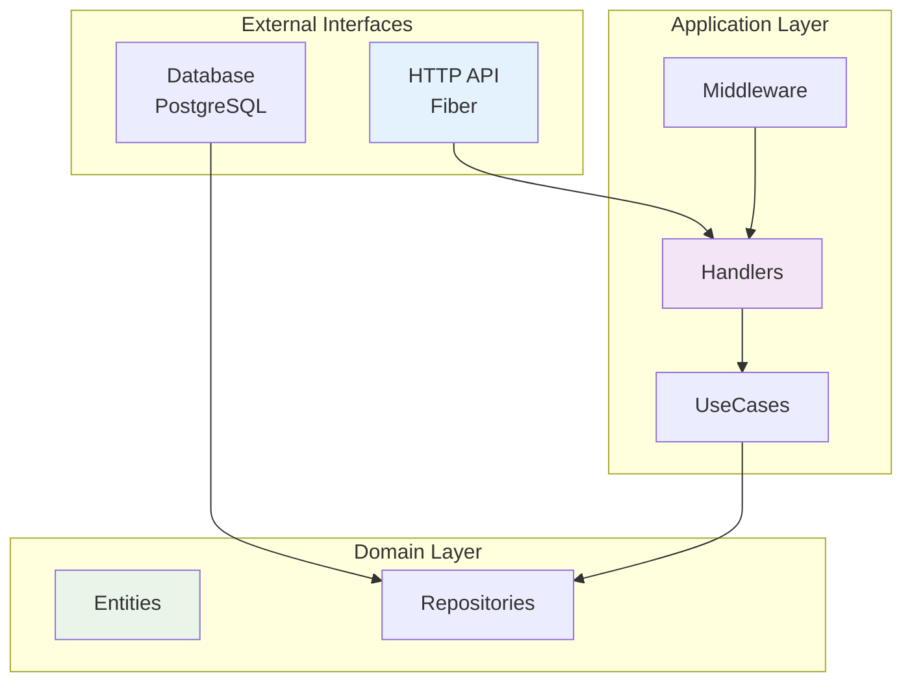

# Payslip Generator Service

A robust, scalable, and secure payroll management system built with Go, designed to handle employee attendance, overtime, reimbursements, and generate comprehensive payslips.

## 📋 Table of Contents

- [🏗️ Architecture Overview](#️-architecture-overview)
- [🚀 Features](#-features)
  - [Core Functionality](#core-functionality)
  - [Technical Features](#technical-features)
- [🛠️ Technology Stack](#️-technology-stack)
  - [Core Framework & Libraries](#core-framework--libraries)
  - [Authentication & Security](#authentication--security)
  - [Validation & Serialization](#validation--serialization)
  - [Utilities & Configuration](#utilities--configuration)
  - [Database Drivers](#database-drivers)
- [📁 Project Structure](#-project-structure)
- [🔌 API Documentation](#-api-documentation)
- [🚀 Getting Started](#-getting-started)
  - [Prerequisites](#prerequisites)
  - [Installation](#installation)
- [🛠️ Development](#️-development)
  - [Available Make Commands](#available-make-commands)
  - [Development Workflow](#development-workflow)
- [🔒 Security Features](#-security-features)
- [📈 Performance Considerations](#-performance-considerations)
- [🔄 API Versioning](#-api-versioning)

## 📚 Documentation

For detailed documentation, please refer to the following guides:

- [📖 API Documentation](./docs/API_DOCUMENTATION.md) - Complete API reference with all endpoints
- [📋 Postman Collection Guide](./docs/POSTMAN_COLLECTION_GUIDE.md) - How to use Postman collections for testing
- [⚙️ Installation & Setup Guide](./docs/PREPARE_INSTALLATION.md) - Detailed installation and configuration instructions

## 🏗️ Architecture Overview

### System Architecture


## 🚀 Features

### Core Functionality
- **Authentication & Authorization**: JWT-based authentication with role-based access control
- **Employee Management**: Employee registration, profile management, and salary configuration
- **Attendance Tracking**: Clock-in/clock-out functionality with time validation
- **Overtime Management**: Overtime hour tracking and calculation
- **Reimbursement System**: Expense reimbursement requests and approval workflow
- **Payroll Processing**: Automated payroll calculation and period management
- **Payslip Generation**: Comprehensive payslip reports with detailed breakdowns
- **Reporting**: Multi-employee payroll reports and analytics

### Technical Features
- **RESTful API**: Standardized REST endpoints with proper HTTP status codes
- **Request Validation**: Comprehensive input validation using go-playground/validator
- **Error Handling**: Structured error responses with detailed error messages
- **Logging**: Structured logging with Logrus for debugging and monitoring
- **Security**: CORS, CSRF protection, rate limiting, and secure headers
- **Database**: PostgreSQL with GORM ORM and ULID primary keys
- **Performance**: Connection pooling, compression, and optimized queries

## 🛠️ Technology Stack

### Core Framework & Libraries
- **Go 1.24.2**: Primary programming language
- **Fiber v2.52.8**: High-performance HTTP framework
- **GORM v1.30.0**: Object-Relational Mapping for database operations
- **PostgreSQL**: Primary database with ULID extension

### Authentication & Security
- **JWT v5.2.2**: JSON Web Tokens for authentication
- **bcrypt**: Password hashing and verification
- **CORS**: Cross-Origin Resource Sharing configuration
- **CSRF**: Cross-Site Request Forgery protection
- **Rate Limiting**: Request rate limiting for API protection

### Validation & Serialization
- **Validator v10.26.0**: Request validation using struct tags
- **Sonic v1.13.3**: High-performance JSON serialization/deserialization

### Utilities & Configuration
- **Viper v1.20.1**: Configuration management
- **Logrus v1.9.3**: Structured logging
- **ULID v2.1.1**: Universally Unique Lexicographically Sortable Identifier
- **Air**: Hot reload for development

### Database Drivers
- **PostgreSQL Driver**: Native PostgreSQL support with connection pooling

## 📁 Project Structure

```
payslip-generator-service/
├── cmd/                    # Application entry point
│   └── main.go            # Main application bootstrap
├── config/                 # Configuration management
│   ├── config.go          # Configuration loader
│   ├── config.json        # Application configuration
│   └── types.go           # Configuration types
├── internal/              # Internal application code
│   ├── app/              # Application bootstrap
│   ├── entity/           # Domain entities/models
│   ├── handler/          # HTTP request handlers
│   ├── middleware/       # Custom middleware
│   ├── model/            # Request/response models
│   ├── repository/       # Data access layer
│   ├── route/            # Route definitions
│   ├── usecase/          # Business logic layer
│   ├── utils/            # Utility functions
│   └── vm/               # View models
├── pkg/                   # Reusable packages
│   ├── database/         # Database utilities
│   ├── fiber/            # Fiber framework setup
│   ├── logger/           # Logging utilities
│   ├── middleware/       # Common middleware
│   └── validator/        # Validation utilities
├── docs/                  # Documentation
│   └── postman/          # Postman collections
├── go.mod                 # Go module definition
├── go.sum                 # Go module checksums
├── Makefile              # Build and deployment scripts
└── README.md             # Project documentation
```

## 🔌 API Documentation

### Base URL
```http
http://localhost:3000/v1
```

### Authentication
All API endpoints (except authentication) require a valid JWT token in the Authorization header:
```
Authorization: Bearer <jwt_token>
```

### API Endpoints

#### Authentication

##### Sign In
```http
POST /auth/sign-in
Content-Type: application/json

{
    "username": "emp_001",
    "password": "Password123!@#"
}
```

**Response:**
```json
{
    "ok": true,
    "data": {
        "access_token": "eyJhbGciOiJIUzI1NiIsInR5cCI6IkpXVCJ9...",
        "refresh_token": "eyJhbGciOiJIUzI1NiIsInR5cCI6IkpXVCJ9..."
    }
}
```

## 🚀 Getting Started

### Prerequisites
- Go 1.24.2 or higher
- PostgreSQL 12 or higher
- Make (for build automation)

### Installation

1. **Clone the repository**
```bash
git clone <repository-url>
cd payslip-generator-service
```

2. **Install dependencies**
```bash
go mod download
```

3. **Configure the application**

modify the configuration on `config/config.json`


4. **Set up the database**
```bash
# Run database migrations
make migrate-up
```

5. **Build and run the application**
```bash
# Development mode with hot reload
make run-dev

# Production mode
make run
```

## 🛠️ Development

### Available Make Commands

```bash
# Database migrations
make migrate-create name=<migration_name>  # Create new migration
make migrate-up                            # Apply migrations
make migrate-down                          # Rollback last migration
make migrate-clean                         # Rollback all migrations
make migrate-status                        # Show migration status

# Build and run
make build                                 # Build the application
make run-dev                               # Run with hot reload
make run                                   # Run in production mode
make clean                                 # Clean build artifacts
make rebuild                               # Force rebuild

# Help
make help                                  # Show all available commands
```

### Development Workflow

1. **Create a new feature branch**
```bash
git checkout -b feature/your-feature-name
```

2. **Make your changes and test**
```bash
make run-dev
```

3. **Create database migration if needed**
```bash
make migrate-create name=add_new_table
```

4. **Run tests and build**
```bash
make build
```

5. **Commit and push your changes**
```bash
git add .
git commit -m "feat(<module>): add new feature"
git push origin feature/your-feature-name
```

## 🔒 Security Features

### Authentication & Authorization
- JWT-based authentication with access and refresh tokens
- Role-based access control (Admin/Employee)
- Secure password hashing with bcrypt
- Token expiration and refresh mechanism

### API Security
- CORS configuration for cross-origin requests
- CSRF protection for state-changing operations
- Rate limiting to prevent abuse
- Input validation and sanitization
- Secure HTTP headers (Helmet.js equivalent)

## 📈 Performance Considerations

- Efficient query optimization with GORM
- Caching strategies for frequently accessed data

## 🔄 API Versioning

The API uses URL versioning (`/v1/`) to ensure backward compatibility. When making breaking changes, create a new version while maintaining the old one for a transition period.

---

